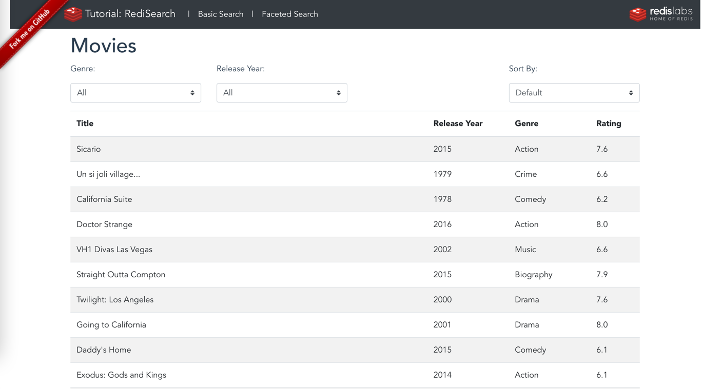
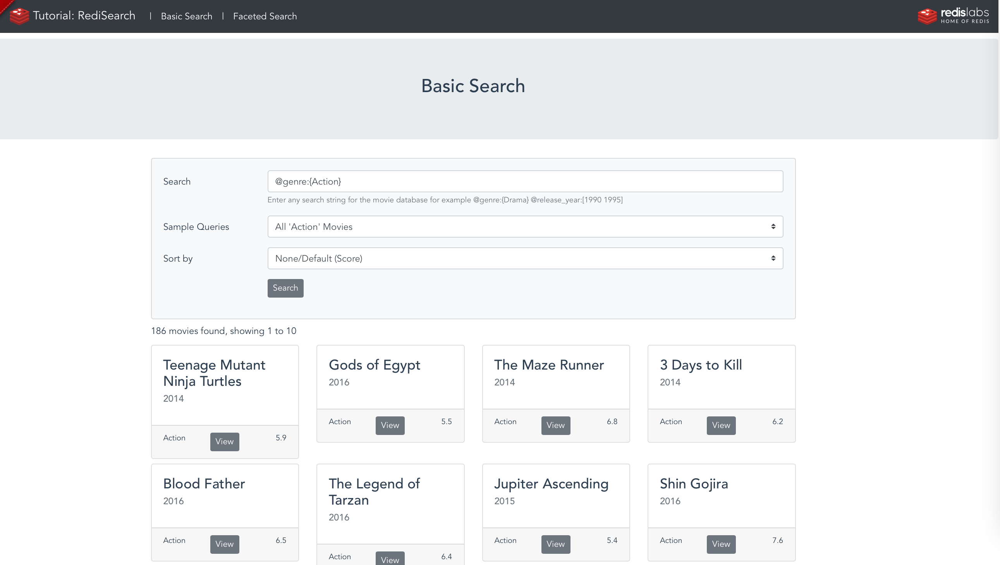
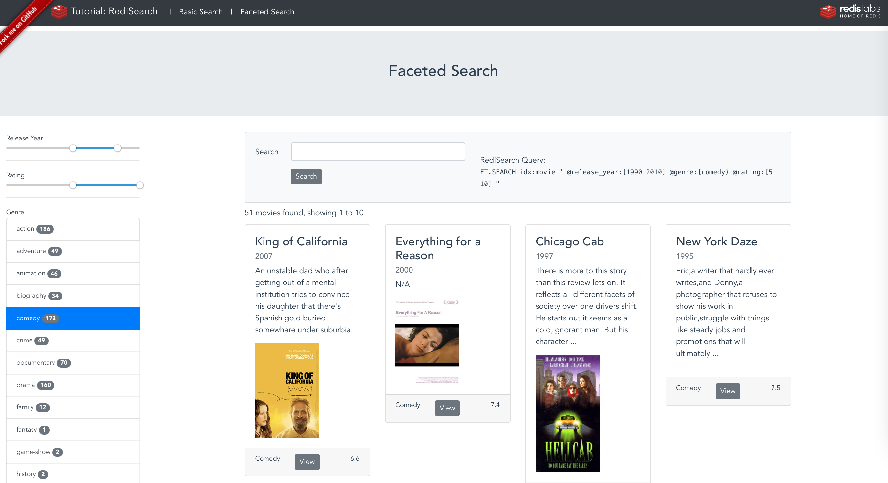

# RediSearch Movie App Demo

The goal of this application is to show how to develop a RediSearch application with Java.

This project is a Spring Boot application.

This application uses [JRediSearch](https://github.com/RediSearch/JRediSearch) that is based on [Jedis](https://github.com/xetorthio/jedis).

This application exposes various endpoint that are directly consumable in a front end.

## How it works?
###Main page



***Example: Get 'Action' Movies released in 2015-2020 and sort by Rating desc***

Select necessary parameters from a dropdown lists via UI;

Redisearch query:
```
> FT.SEARCH idx:movie "@genre:{Action} @release_year:[2015 2020] SORTBY rating desc"
```
___
### Basic Search



Enter any search string for the movie database for example ```@genre:{Drama} @release_year:[1990 1995]```

**Some Sample Queries**:

***Fuzzy Search 'empre', for 'Empire''***

Search: ```%empre%```

```
> FT.SEARCH idx:movie "%empre% "
```

***All 'Action' Movies***

Search: ```@genre:{Action}``` 

```
> FT.SEARCH idx:movie "@genre:{Action} "
```

***All movies relaesed in 2000***

Search: ```@release_year:[2000 2000]```

```
> FT.SEARCH idx:movie "@release_year:[2000 2000] "
```

***'Drama' from 2010 to 2020***

Search: ```@genre:{Drama} @release_year:[2010 2020]```

```
> FT.SEARCH idx:movie "@genre:{Drama} @release_year:[2010 2020] "
```

***Star Wars Movies***

Search: ```star wars```

```
> FT.SEARCH idx:movie "star wars "
```

***Star Wars movies that does not mention Jedi***

Search: ```star wars -jedi```

```
> FT.SEARCH idx:movie "star wars -jedi "
```
___

###Faceted Search



**Example : *All the movies that contains the string "`war`"***

Search: ```war```
Release years: 1960-2020
Rating: 0-10

Redisearch query:

```
> FT.SEARCH idx:movie "war @release_year:[1960 2020] @rating:[0 10] "
1) (integer) 2
2) "movie:11005"
3)  1) "title"
    2) "Star Wars: Episode VI - Return of the Jedi"
    ...
   14) "tt0086190"
4) "movie:11002"
5)  1) "title"
    2) "Star Wars: Episode V - The Empire Strikes Back"
    ...
   13) "imdb_id"
   14) "tt0080684"
```

The FT.SEARCH commands returns a list of results starting with the number of results, then the list of elements (keys & fields).

As you can see the movie *Star Wars: Episode V - The Empire Strikes Back* is found, even though you used only the word “war” to match “Wars” in the title. This is because the title has been indexed as text, so the field is [tokenized](https://oss.redislabs.com/redisearch/Escaping/) and [stemmed](https://oss.redislabs.com/redisearch/Stemming/).

---
**Example : *All the movies that contains the string "`war` but NOT the `jedi` one"***

Search: ```war -jedi```

Release years: 1960-2020

Rating: 0-10

Adding the string `-jedi` (minus) will ask the query engine not to return values that contain `jedi`.

Redisearch query:
```
> FT.SEARCH idx:movie "war -jedi @release_year:[1960 2020] @rating:[0 10]"
1) (integer) 1
2) "movie:11002"
3) 1) "title"
   2) "Star Wars: Episode V - The Empire Strikes Back"
   3) "release_year"
   4) "1980"
```

---
**Example : *All the movies that contains the string "`gdfather` using fuzzy search"***

**Search**: ```%gdfather%```

Release years: 1960-2020

Rating: 0-10

As you can see the word godfather contains a speelling error, it can however be matched using [fuzzy matching](https://oss.redislabs.com/redisearch/Query_Syntax/#fuzzy_matching). Fuzzy matches are performed based on [Levenshtein distance](https://en.wikipedia.org/wiki/Levenshtein_distance) (LD).

Redisearch query:

```
> FT.SEARCH idx:movie "%gdfather% @release_year:[1960 2020] @rating:[0 10] "
1) (integer) 1
2) "movie:11003"
3) 1) "title"
   2) "The Godfather"
   3) "release_year"
   4) "1972"
```

---
**Example  : *All `Thriller` movies"***

The `genre` fields is indexed as a TAG and allows exact match queries.

The syntax to query a TAG field is  @field_name:{value}

Search: ```@genre:{Thriller}```

Release years: 1960-2020

Rating: 0-10

Redisearch query:
```
> FT.SEARCH idx:movie "@genre:{Thriller}" @release_year:[1960 2020] @rating:[0 10]
1) (integer) 1
2) "movie:11004"
3) 1) "title"
   2) "Heat"
   3) "release_year"
   4) "1995"
```

---
**Example : *All `Thriller` or `Action` movies"***

Search: ```@genre:{Thriller|Action}```

Release years: 1960-2020

Rating: 0-10

Redisearch query:

```
> FT.SEARCH idx:movie "@genre:{Thriller|Action}" @release_year:[1960 2020] @rating:[0 10]
1) (integer) 3
2) "movie:11004"
3) 1) "title"
   2) "Heat"
   3) "release_year"
   4) "1995"
4) "movie:11005"
5) 1) "title"
   2) "Star Wars: Episode VI - Return of the Jedi"
   3) "release_year"
   4) "1983"
6) "movie:11002"
7) 1) "title"
   2) "Star Wars: Episode V - The Empire Strikes Back"
   3) "release_year"
   4) "1980"
```

You can find more information about the Tag filters in [the documentation](https://oss.redislabs.com/redisearch/master/Query_Syntax/#tag_filters).

---
**Example : *All `Thriller` or `Action` movies that does not have `Jedi` in the title"***

Search: ```@genre:{Thriller|Action} @title:-jedi```

Release years: 1960-2020

Rating: 0-10

Redisearch query:

```
> FT.SEARCH idx:movie "@genre:{Thriller|Action} @title:-jedi" @release_year:[1960 2020] @rating:[0 10]
1) (integer) 2
2) "movie:11004"
3) 1) "title"
   2) "Heat"
   3) "release_year"
   4) "1995"
4) "movie:11002"
5) 1) "title"
   2) "Star Wars: Episode V - The Empire Strikes Back"
   3) "release_year"
   4) "1980"
```

---

### How the data is stored:

As a Redis developer, one of the first things to look when building your application is to define the structure of the key and data (data design/data modeling).

A common way of defining the keys in Redis is to use specific patterns in them. For example in this application where the database will probably deal with various business objects: movies, actors, theaters, users, ... we can use the following pattern:

* `business_object:key`

For example:
* `movie:001` for the movie with the id 001
* `user:001` the user with the id 001


and for the movies information you should use a Redis [Hash](https://redis.io/topics/data-types#hashes).

A Redis Hash allows the application to structure all the movie attributes in individual fields; also RediSearch will index the fields based on the index definition.


**Movies**

The file `/redisearch-docker/dataset/import_movies.redis` is a script that creates 922 Hashes.

The movie hashes contain the following fields.

* **`movie:id`** : The unique ID of the movie, internal to this database (used as the key of the hash)
* **`title`** : The title of the movie.
* **`plot`** : A summary of the movie.
* **`genre`** : The genre of the movie, for now a movie will only have a single genre.
* **`release_year`** : The year the movie was released as a numerical value.
* **`rating`** : A numeric value representing the public's rating for this movie.
* **`votes`** : Number of votes.
* **`poster`** : Link to the movie poster.
* **`imdb_id`** : id of the movie in the [IMDB](https://imdb.com) database.

<details> 
  <summary>Sample Data: <b>movie:521</b></summary>
  <table>
      <thead>
        <tr>
            <th>Field</th>
            <th>Value</th>
        </tr>
    </thead>
  <tbody>
    <tr>
        <th>title</th>
        <td style='font-family:monospace; font-size: 0.875em; "'>
        Spider-Man
        </td>
    </tr>
    <tr>
        <th>plot</th>
        <td style='font-family:monospace; font-size: 0.875em; "'>
        When bitten by a genetically modified spider a nerdy shy and awkward high school student gains spider-like abilities that he eventually must use to fight evil as a superhero after tragedy befalls his family.
        </td>
    </tr>
    <tr>
        <th>genre</th>
        <td style='font-family:monospace; font-size: 0.875em; "'>
        Action
        </td>
    </tr>
    <tr>
        <th>release_year</th>
        <td style='font-family:monospace; font-size: 0.875em; "'>
        2002
        </td>
    </tr>
    <tr>
        <th>rating</th>
        <td style='font-family:monospace; font-size: 0.875em; "'>
        7.3
        </td>
    </tr>
    <tr>
        <th>votes</th>
        <td style='font-family:monospace; font-size: 0.875em; "'>
        662219
        </td>
    </tr>
    <tr>
        <th>poster</th>
        <td style='font-family:monospace; font-size: 0.875em; "'>
        https://m.media-amazon.com/images/M/MV5BZDEyN2NhMjgtMjdhNi00MmNlLWE5YTgtZGE4MzNjMTRlMGEwXkEyXkFqcGdeQXVyNDUyOTg3Njg@._V1_SX300.jpg
        </td>
    </tr>
    <tr>
        <th>imdb_id</th>
        <td style='font-family:monospace; font-size: 0.875em; "'>
        tt0145487
        </td>
    </tr>
    <tbody>
  </table>
</details>

**Actors**

The file `/redisearch-docker/dataset/import_actors.redis` is a script that creates 1319 Hashes.

The movie hashes contain the following fields.

* **`actor:id`** : The unique ID of the actor
* **`first_name`** : The first name of the actor.
* **`last_name`** : The last name of the actor.
* **`date_of_birth`** : The birth year of the actor

<details> 
  <summary>Sample Data: <b>actor:521</b></summary>
  <table>
      <thead>
        <tr>
            <th>Field</th>
            <th>Value</th>
        </tr>
    </thead>
  <tbody>
    <tr>
        <th>first_name</th>
        <td style='font-family:monospace; font-size: 0.875em; "'>
        Renee
        </td>
    </tr>
    <tr>
        <th>last_name</th>
        <td style='font-family:monospace; font-size: 0.875em; "'>
        Olstead
        </td>
    </tr>
    <tr>
        <th>date_of_birth</th>
        <td style='font-family:monospace; font-size: 0.875em; "'>
        1989
        </td>
    </tr>
    <tbody>
  </table>
</details>

**Users**

The file `/redisearch-docker/dataset/import_users.redis` is a script that creates 5996 Hashes.

The user hashes contain the following fields.

* **`user:id`** : The unique ID of the user.
* **`first_name`** : The first name of the user.
* **`last_name`** : The last name of the user.
* **`email`** : The email of the user.
* **`gender`** : The gender of the user (`female`/`male`).
* **`country`** : The country name of the user.
* **`country_code`** : The country code of the user.
* **`city`** : The city of the user.
* **`longitude`** : The longitude of the user.
* **`latitude`** : The latitude of the user.
* **`last_login`** : The last login time for the user, as EPOC time.
* **`ip_address`** : The IP address of the user.

<details> 
 <summary>Sample Data: <b>user:3233</b></summary>
  <table>
      <thead>
        <tr>
            <th>Field</th>
            <th>Value</th>
        </tr>
    </thead>
  <tbody>
    <tr>
        <th>first_name</th>
        <td style='font-family:monospace; font-size: 0.875em; "'>
        Rosetta
        </td>
    </tr>
    <tr>
        <th>last_name</th>
        <td style='font-family:monospace; font-size: 0.875em; "'>
        Olyff
        </td>
    </tr>
    <tr>
        <th>email</th>
        <td style='font-family:monospace; font-size: 0.875em; "'>
        rolyff6g@163.com
        </td>
    </tr>
    <tr>
        <th>gender</th>
        <td style='font-family:monospace; font-size: 0.875em; "'>
        female
        </td>
    </tr>
    <tr>
        <th>country</th>
        <td style='font-family:monospace; font-size: 0.875em; "'>
        China
        </td>
    </tr>
    <tr>
        <th>country_code</th>
        <td style='font-family:monospace; font-size: 0.875em; "'>
        CN
        </td>
    </tr>
    <tr>
        <th>city</th>
        <td style='font-family:monospace; font-size: 0.875em; "'>
        Huangdao
        </td>
    </tr>
    <tr>
        <th>longitude</th>
        <td style='font-family:monospace; font-size: 0.875em; "'>
        120.04619
        </td>
    </tr>
    <tr>
        <th>latitude</th>
        <td style='font-family:monospace; font-size: 0.875em; "'>
        35.872664
        </td>
    </tr>
    <tr>
        <th>last_login</th>
        <td style='font-family:monospace; font-size: 0.875em; "'>
        1570386621
        </td>
    </tr>
    <tr>
        <th>ip_address</th>
        <td style='font-family:monospace; font-size: 0.875em; "'>
        218.47.90.79
        </td>
    </tr>
    <tbody>
  </table>
</details>

### Create the Index

Create the index with the following command:

```
> FT.CREATE idx:movie ON hash PREFIX 1 "movie:" SCHEMA title TEXT SORTABLE release_year NUMERIC SORTABLE rating NUMERIC SORTABLE genre TAG SORTABLE
```

Before running some queries let's look at the command in detail:

* [`FT.CREATE`](https://oss.redislabs.com/redisearch/master/Commands/#ftcreate) : creates an index with the given spec. The index name will be used in all the key names so keep it short.
* `idx:movie` : the name of the index
* `ON hash` : the type of structure to be indexed. *Note that in RediSearch 2.0 only hash structures are supported, this parameter will accept other Redis data types in future as RediSearch is updated to index them*
* `PREFIX 1 "movie:"` : the prefix of the keys that should be indexed. This is a list, so since we want to only index movie:* keys the number is 1. Suppose you want to index movies and tv_show that have the same fields, you can use: `PREFIX 2 "movie:" "tv_show:"`
* `SCHEMA ...`: defines the schema, the fields and their type, to index, as you can see in the command, we are using [TEXT](https://oss.redislabs.com/redisearch/Query_Syntax/#a_few_query_examples), [NUMERIC](https://oss.redislabs.com/redisearch/Query_Syntax/#numeric_filters_in_query) and [TAG](https://oss.redislabs.com/redisearch/Query_Syntax/#tag_filters), and [SORTABLE](https://oss.redislabs.com/redisearch/Sorting/) parameters.

You can find information about the [FT.CREATE](https://oss.redislabs.com/redisearch/Commands/#ftcreate) command in the [documentation](https://oss.redislabs.com/redisearch/Commands/#ftcreate).


You can look at the index information with the following command:

```
> FT.INFO idx:movie
```

### How the data is accessed:

One of the goals of RediSearch is to provide rich querying capabilities such as:

* simple and complex conditions
* sorting
* pagination
* counting


### Conditions

The best way to start to work with RediSearch query capabilities is to look at the various conditions options.


<details> 
  <summary>
  <i><b>
  Find all the movies that contain the word 'heat' or related to 'heat'
  </b></i>
  </summary>

```
> FT.SEARCH "idx:movie" "heat" RETURN 2 title plot

1) (integer) 4
2) "movie:1141"
3) 1) "title"
   2) "Heat"
   3) "plot"
   4) "A group of professional bank robbers start to feel the heat from police when they unknowingly leave a clue at their latest heist."
4) "movie:818"
5) 1) "title"
   2) "California Heat"
   3) "plot"
   4) "A lifeguard bets he can be true to just one woman."
6) "movie:736"
7) 1) "title"
   2) "Chicago Justice"
   3) "plot"
   4) "The State's Attorney's dedicated team of prosecutors and investigators navigates heated city politics and controversy head-on,while fearlessly pursuing justice."
8) "movie:1109"
9) 1) "title"
   2) "Love & Hip Hop: Miami"
   3) "plot"
   4) "'Love and Hip Hop Miami' turns up the heat and doesn't hold back in making the 305 the place to be. Multi-platinum selling hip-hop legend Trick Daddy is back in the studio collaborating ..."

```

The first line contains the number of documents (`4`) that match the query condition, then the list of movies.

This query is a "fieldless" condition, this means that the query engine has:
* searched in all the TEXT fields of the index(`title` and `plot`)
* for the word `heat` and related words, this is why the movie:736 is returned since it has the word `heated` in the plot ([stemming](https://oss.redislabs.com/redisearch/Stemming/))
* returned the result sorted by score, remember that the title has a weight of 1.0, and the plot a weight of 0.5. So when the word or related words are found in the title the score is larger.
---
</details>


<details> 
  <summary>
  <i><b>
    Find all the movies with a title that contains the word 'heat' or related to 'heat'
  </b></i>
  </summary>

In this case you have to set the criteria to a the field title using the `@title` notation.

```
> FT.SEARCH "idx:movie" "@title:heat" RETURN 2 title plot
1) (integer) 2
2) "movie:1141"
3) 1) "title"
   2) "Heat"
   3) "plot"
   4) "A group of professional bank robbers start to feel the heat from police when they unknowingly leave a clue at their latest heist."
4) "movie:818"
5) 1) "title"
   2) "California Heat"
   3) "plot"
   4) "A lifeguard bets he can be true to just one woman."

```

So only 2 movies are returned.

---
</details>


<details> 
  <summary>
  <i><b>
  Find all the movies where the title contains 'heat' and does NOT contains 'california'
  </b></i>
  </summary>

For this you add parentheses around the field condition and add the `-` sign to 'california'.

```
> FT.SEARCH "idx:movie" "@title:(heat -california)" RETURN 2 title plot
1) (integer) 1
2) "movie:1141"
3) 1) "title"
   2) "Heat"
   3) "plot"
   4) "A group of professional bank robbers start to feel the heat from police when they unknowingly leave a clue at their latest heist."

```

Only one movie is returned.

If you do not put the `( .. )` the `-california` condition will be applied to all the text fields.

You can do test this with the following queries:

```
> FT.SEARCH "idx:movie" "@title:(heat -woman)" RETURN 2 title plot
```

```
> FT.SEARCH "idx:movie" "@title:heat -woman" RETURN 2 title plot
```

As you can see the first query only searches for woman in the title and returns two movies "Heat" and "California Heat", where the second query eliminates "California Heat" from the list since the plot contains the word `woman`.

---
</details>


<details> 
  <summary>
  <i><b>
  Find all the 'Drama' movies that have 'heat' in the title
  </b></i>
  </summary>

As you have seen earlier the movie index contains:
* the `title` and plot as TEXT
* the `genre` as TAG.

You saw earlier how to place a condition on a TEXT field.

The [TAG](https://oss.redislabs.com/redisearch/Tags/) is a little bit different as the index engine does not do any stemming.

To set a condition on this field you must use the `@field:{value}` notation, the `{...}` indicates that it is a TAG condition


```
>  FT.SEARCH "idx:movie" "@title:(heat) @genre:{Drama} " RETURN 3 title plot genre
1) (integer) 1
2) "movie:1141"
3) 1) "title"
   2) "Heat"
   3) "plot"
   4) "A group of professional bank robbers start to feel the heat from police when they unknowingly leave a clue at their latest heist."
   5) "genre"
   6) "Drama"
```

As you can see this query applies conditions to two different fields with an exact match on the TAG.

TAG is the structure to use when you want to do exact matches on strings/words.
---
</details>


<details> 
  <summary>
  <i><b>
  Find all the 'Drama' or 'Comedy' movies that have 'heat' in the title
  </b></i>
  </summary>

This is similar to the previous query, you can pass a list of values with the `|` to represent the OR.


```
> FT.SEARCH "idx:movie" "@title:(heat)  @genre:{Drama|Comedy} " RETURN 3 title plot genre

1) (integer) 2
2) "movie:1141"
3) 1) "title"
   2) "Heat"
   3) "plot"
   4) "A group of professional bank robbers start to feel the heat from police when they unknowingly leave a clue at their latest heist."
   5) "genre"
   6) "Drama"
4) "movie:818"
5) 1) "title"
   2) "California Heat"
   3) "plot"
   4) "A lifeguard bets he can be true to just one woman."
   5) "genre"
   6) "Comedy"
```


You can also put the '|' between all the conditions to search for example all movies that have "heat" in the title, or that are Comedy or that are Drama. The query will look like:

```
FT.SEARCH "idx:movie" "@title:(heat) | @genre:{Drama|Comedy} " RETURN 3 title plot genre
```

---
</details>


<details> 
  <summary>
  <i><b>Find all 'Mystery' OR 'Thriller' movies, released in 2014 OR 2018</b></i>
  </summary>

In this query, the new item is the query on a numeric field (release_year).

Like before, for the condition you have to use the `@field:` notation, but for a numeric field you have to put the interval of the condition.

In this query it will be two conditions with an OR (`|`).

```
> FT.SEARCH "idx:movie" "@genre:{Mystery|Thriller} (@release_year:[2018 2018] | @release_year:[2014 2014] )"   RETURN 3 title release_year genre

1) (integer) 3
2) "movie:461"
3) 1) "title"
   2) "The Boat ()"
   3) "release_year"
   4) "2018"
   5) "genre"
   6) "Mystery"
4) "movie:65"
5) 1) "title"
   2) "The Loft"
   3) "release_year"
   4) "2014"
   5) "genre"
   6) "Mystery"
6) "movie:989"
7) 1) "title"
   2) "Los Angeles Overnight"
   3) "release_year"
   4) "2018"
   5) "genre"
   6) "Thriller"
```


---
</details>

Summary

* Fieldless queries apply to all TEXT fields and use the words and their base form (stemming)
* To apply a condition to a specific field you must use the `@field:` notation
* Multiple conditions are "intersection" (AND condition), to do a "union" (OR condition), you have to use the "`|`" character.

----
### Sort

A very common use case when querying data is to sort the data on a specific field, and paginate over the result.

<details> 
  <summary>
  <i><b>Query all the `Action` movies, sorted by release year from most recent to the oldest</b></i>
  </summary>

```
> FT.SEARCH "idx:movie" "@genre:{Action}"  SORTBY release_year DESC RETURN 2 title release_year
 1) (integer) 186
 2) "movie:360"
 3) 1) "release_year"
    2) "2019"
    3) "title"
    4) "Spider-Man: Far from Home"
 ...
20) "movie:278"
21) 1) "release_year"
    2) "2016"
    3) "title"
    4) "Mechanic: Resurrection"
```

The first line contains the number of documents (`186`) that match the query condition.

The FT.SEARCH command, by default, returns the first ten documents. You will see in the next query how to paginate.

You can only use one SORTBY clause in an FT.SEARCH query, if you want to sort on multiple fields, for example sorting movies by `genre` ascending and `release_year` descending, you have to use an FT.AGGREGATE, this is covered in the [next section](008-aggregation.md).

Note: The field used in the [SORTBY](https://oss.redislabs.com/redisearch/Sorting/#specifying_sortby) should be part of the index schema and defined as SORTABLE.
---
</details>

----
### Paginate

<details> 
  <summary>
  <i><b>Query all the `Action` movies, sorted by release year from the oldest to the most recent one, returning the record by batch of 100 movies</b></i>
  </summary>

```
> FT.SEARCH "idx:movie" "@genre:{Action}" LIMIT 0 100  SORTBY release_year ASC RETURN 2 title release_year
  1) (integer) 186
  2) "movie:892"
  3) 1) "release_year"
     2) "1966"
     3) "title"
     4) "Texas,Adios"
...  
200) "movie:12"
201) 1) "release_year"
     2) "2014"
     3) "title"
     4) "Fury"
```

The result is very similar to the previous query:
* 186 documents found
* the first document is the oldest one, released in 1966
* the latest movie of the batch was released in 2014


To paginate to the next batch you need to change the limit as follows:

```
> FT.SEARCH "idx:movie" "@genre:{Action}" LIMIT 100 200  SORTBY release_year ASC RETURN 2 title release_year
```
---
</details>


----
### Count


<details> 
  <summary>
  <i><b>Count the number of 'Action' movies</b></i>
  </summary>

Based on the sample queries that you have seen earlier, if you specify `LIMIT 0 0` it will give you the number of documents based on the query condition.

```
> FT.SEARCH "idx:movie" "@genre:{Action}" LIMIT 0 0

1) (integer) 186
```
---
</details>


<details> 
  <summary>
  <i><b>Count the number of 'Action' movies released in 2017 </b></i>
  </summary>

Based on the sample queries that you have seen earlier, if you specify `LIMIT 0 0` it will give you the number of documents based on the query condition.

```
> FT.SEARCH "idx:movie" "@genre:{Action}" FILTER release_year 2017 2017 LIMIT 0 0

1) (integer) 5
```

You can also use the following syntax:

```
> FT.SEARCH "idx:movie" "@genre:{Action} @release_year:[2017 2017]" LIMIT 0 0

1) (integer) 5
```

---
</details>


----

## How to run it locally?

### Running the application in Docker

The application and all the services, including RediSearch, are available as a Docker Compose application.

**NOTE: You need to specify required environment variables in ```docker-compose.yml``` under service ```rest-java```**:

```
REDIS_ENDPOINT_URL=redis://<your endpoint url>
REDIS_PASSWORD=
REDIS_INDEX=(by default idx:movie)
```

To run the application:

```
> docker-compose up --force-recreate --build
```

This Docker Compose will start:

1. RediSearch instance on port 6380, and import all movies, actors and create indexes
1. The Java REST Service available on port 8085
1. The frontend on port 8084

Once started you can access the application and its services using the following URLs:

* http://localhost:8084
* http://localhost:8085/api/1.0/movies/search?q=star&offset=0&limit=10


#### Stop and Delete Everything

Run the following command to delete the containers & images:

```
> docker-compose down -v --rmi local --remove-orphans
```